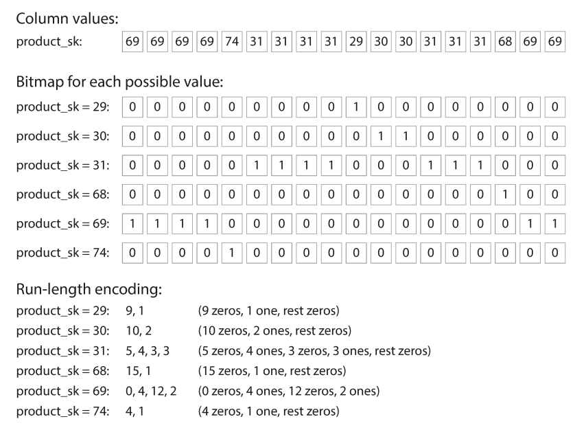

This chapter is a foundational deep dive into how databases actually handle data under the hood.

# Database Data Structures
We can implement a simple key-value store with two Bash functions:
```bash
db_set() {
    echo "$1,$2" >> database
}

db_get() {
    grep "^$1," database | sed -e "s/^1,//" | tail -n 1
}
```

The underlying storage format is a text file where each line contains a key-value pair (comma-separated). 
- `db_set()` appends a new key-value pair to a text file
- `db_get()` uses grep to find the last occurrence of the key in the file to return the latest value.

The file that we use for storage and retrieval is a **log**, an append-only data file.

This simple data structure comes with the trade-offs:
- **Performant writes**: appending to the file is very efficient because it is a sequential operation.
- **Poor read performance**: The cost of a lookup is $O(n)$, where $n$ is the number of entries.

The solve this, we need an **index**. This is additional metadata that helps to locate the data. This improves read performance but incurs overhead since we need to write additional structures. Because of this, choosing an index is left to the application developer, using the knowledge of the typical query patterns.

### Hash Index

The simplest indexing strategy is to keep an **in-memory hash map** where every key is mapped to a **byte offset** in the data file.
- When writing a key, update the hash map with the offset of the data appended.
- To read, look up the offset in the hash map, seek to that location on disk, and read that value.
- **Constraint**: All keys must fit in available RAM. This makes it perfect for workloads with many writes per key (like a counter), but a low number of distinct keys.
This approach is used for **Bitcask** (the default storage engine for Riak).

### Compaction

If we only ever append to a file, we might eventually run out of disk space. The solution is **compaction**:
1. Break the log into segments.
2. A background process throws away duplicate keys, keeping only the most recent update for each.
3. Segments are merged together to keep the total number of files small.

### Practical issues 

While our key-value store was simple, there are a number of practical issues that need to be addressed for real database systems.

- **File format**: CSV is easy for humans to read, but is inefficient for a database.
    - Use a binary format encoding the length of a string first, followed by raw bytes.
    - This is faster for a machine to parse and simpler to process.

- **Deleting records**: In an append-only log, we cannot erase old lines.
    - Append a special record called a **tombstone** associated with the key.
    - During compaction, it sees the tombstone and knows to discard any previous values for that key, eventually removing it from the new, merged segments.

- **Crash recovery**: Because the hash map lives in memory, a crash would wipe the index.
    - *Naive solution*: rebuild the index by reading all the segments. For large files, the makes restarts very slow.
    - *Bitcask optimization*: Store a snapshot of each segment's has map on disk. When the system reboots, it can load the snapshots into memory, which is faster than a full scan.

- **Partially written records**: A carsh can happen while the database is writing a record.
    - Detect the partial entries using checksums that are included in the file.
    - When detecting a corrupted record, it can safely ignore that partial entry.

- **Concurrency**: handling multiple users at once is a classic database challenge.
    - *Single writer*: many implementations use a single writer thread to avoid ace conditions.
    - *Multiple readers*: The data segments are immutable, so many threads can lead simultaneously without locking.

### Tradeoffs

It might seem wasteful to never "overwrite" data in place, but it offers many advantages:
1. *Sequential writes*: Appending is much faster than random-access writes, especially on hard disks.
2. *Simpler recovery*: These are much simpler if segment files are immutable. 
3. *No fragmentation*: Periodically merging segments prevents the data files from getting fragmented over time.

There are still some limitations of the hash table index:
1. The hash table must fit into memory, so it will not work for a massive number of keys.
    - Theoretically, we could use an on-disk hash map. But this would perform very poorly since it requires significant random access I/O.
2. Range queries are not efficient. It requires looking up each individual key in the range.

## Log-Sorted Merge-Trees (LSM-trees)
**Sorted String Tables (SSTables)** address the limitations of our original log-structured storage by requiring that the sequence of key-value pairs in our segment files are *sorted by key*.
- **Efficient merging**: Even if the segment files are larger than the available memory, we can merge them using a technique similar to merge sort.
    - Read multiple segments side-by-side, look at the first key in each, and copy the lowest key to a new output file (similar to **mergesort**). This produces a new merged segment file that is sorted by key.
- **Sparse index**: The in-memory index can be **sparse** since it only needs to store the offset for the start of each segment.
- **Block compression**: Since search requires scanning within the segment range, we can group records into **compressed blocks** before writing them to disk.
    - The sparse index points to the start of these compressed chunks.
- **Efficient range queries**: Since the keys are physically adjacent on disk, range queries become a simple **sequential read**.

### Constructing and maintaining SSTables
Our incoming writes can occur in any order, so we need an additional structure to maintain the sort.

1. When a write arrives, it is added to an in-memory balanced tree structure (like a red-black tree), called a **memtable**.
    - Once the memtable grows past a certain size threshold (a few megabytes), it is written to disk as an SSTable file.
    - While the old memtable is being written to disk, a new memtable instance handles incoming writes.
2. To find a key, the storage engine **first checks the memtable** to see if the key is in-memory. Otherwise, it **checks the SSTable segments** (starting with the most recent segment, then the next-older segment, etc).
3. A compaction process runs in the background to combine segment files and to discard overwritten or deleted values.

One scenario we still need to handle is the case where the database crashes. In this case, everything in the memtable is wiped out since it hasn't been written to an SSTable yet. To resolve this, we use an **append-only log** corresponding to each memtable. 
    - Each write is appended to an unsorted log before being added to the memtable.
    - If the system crashes, the database reads to log to rebuild the memtable.
    - Once a memtable is flushed to an SSTable, the recovery log is deleted because the data has already been persisted.

This whole scheme—memtable + recovery log + SSTables + background merging—is a **Log-Structured Merge-Tree (LSM-Tree)**.

### Bloom Filters

The biggest performance bottleneck in an LSM-tree occurs when you search for a key that does not exist in the database.
- Because the data is spread across the memtable and multiple SSTable segments, the engine has to check the memtable, and then every segment on disk before it can detect that the key is missing.
- This leads to many unnecessary and expensive disk reads.

A **Bloom filter** is a memory-efficient data structure used to approximate the contents of a set. 
- When a key is added to the database, it is "hashed" several times, and the corresponding bits in a bit array are set to $1$.
- If we check the filter for a key and any of the bits are $0$, the engine knows that the key is not in the database.
- If all the bits are $1$, the key is there with some probability. There is a change of a false positive, but the engine can fall back to a standard disk scan in those cases.

#### False positive rate
Suppose we have a bit array of size $m$ and $k$ independent hash functions.

The probability a specific bit is still $0$ after $k$ hashes for $n$ elements is 

$$\left(1 - \frac{1}{m} \right)^{kn}.$$

Using the identity $\lim_{x \to \infty} \left(1 - \frac{1}{x} \right)^x = \frac{1}{e}$, we can approximate 

$$\left(1 - \frac{1}{m} \right)^{kn} = \left(1 - \frac{1}{m} \right)^{m \cdot \frac{kn}{m}} \approx e^{-kn/m}.$$

Thus, the probability a bit is $1$ is given by 

$$1 - e^{-kn/m}.$$

Finally, the false positive rate $\epsilon$ is the probability that all $k$ bits for a new element are already set to $1$. This is given by 

$$\epsilon = \left( 1 - \left(1 - \frac{1}{m} \right)^{kn}\right)^k\approx \left(1 - e^{-kn/m}\right)^k.$$

## B-trees
While LSM-trees are gaining popularity, **B-trees** are the most widely used indexing structure and the standard implementation in almost all relational databases.

The core difference between the two has to do with how they organize data on disk:
- LSM-trees break the database into variable-size segments (several MBs) and write them sequentially.
- B-trees break the database into fixed-size blocks/pages (4 KB in size).

A B-tree lookup starts at a single **root page**.
- Each page contains keys and **references to child pages**. Each child is responsible for a continuous range of keys.
- The number of references in one page is the **branching factor**. In practice, this is typically several hundred.
- Because of the high branching factor, a massive database can be navigated in a tree only three or four levels deep.
    - A 4-level tree of 4 KB pages can store up to **256 TB**.

To update the value for an existing key in a $B$-tree:
- Search for the leaf page containing the key, change the value, and write that page back to disk.
- If a new key is added and there isn't enough space in a page, it is **split** into two half-full pages.
- The parent page is then updated to account for the new subdivision of key ranges. This ensures that the tree remains balanced with a depth of $O(\log n)$.

Because B-trees overwrite pages, a crash during a page split is dangerous—it can leave the index corrupted (an "orphan" page with no parent).
- To make the database resilient, B-trees use a **write-ahead log (WAL)**.
- This is an append-only file where every modification is written before it is applied to the tree pages.
- The database can use this log to restore the tree to a consistent state.

Since multiple threads might access the tree simultaneously, B-trees protect their data structures with **latches** to provent a thread from seeing the tree in an inconsistent state during a split.

### B-tree optimizations
B-trees have been the industry standard since the 1970s and engineers have developed several optimizations for extra performance and reliability.

**Copy-on-Write (Shadow Paging)**: Instead of overwriting a page in-place and relying on a WAL, some databases (e.g. LMDB) use copy-on-write:
- A modified page is written to a new location on disk.
- The database then creates new versions of parent pages that point to this new location, cascading up the tree.
- This is helpful for **snapshot isolation**: readers can continue looking at the old version of the tree while a writer is busy creating a new one.

**Key Compression (Abbreviation)**: Increase the efficiency of each page by reducing the space each key takes up.
- Interior pages don't need the full key. They only need enough information to act as a boundary between pages.
- By packing more keys onto a single page, we increase the branching factor and reduce the depth.

**Sequential Layout**: In a standard B-tree, pages can be scattered anywhere on disk. This is inefficient for range scans because every new page might require a random disk seek.
- Many implementations try to lay out the tree so that leaf pages appear in sequential order on disk.
- Maintaining this order is very difficult as the tree grows and pages split.
- By contrast, LSM-trees have an advantage since the merging process naturally rewrites data in large, sequential segments.

**Sibling pointers**: To make range scans faster, many B-trees add extra pointers that aren't part of the strict tree hierarchy.
- Each leaf page can contain a reference to its sibling pages to the left and right.
- This allows a query to scan across the leaves in order without having to jump bank up to the parent pages for every new range.

### Comparing B-Trees and LSM-Trees

**Write throughput**:
- LSM-trees support high write throughput because they turn random writes into sequential writes on disk.
- B-trees are slower for writes because every piece of data must be written twice: once to the WAL and once to the tree page itself.

**Write amplification**: Overwriting blocks on SSDs will eventually cause the performance to degrade. 
 - B-trees must write an entire 4 KB page even if only a few bytes change
 - LSM-trees rewrite data during background compaction.

**Read performance**:
- B-trees are faster for reads because each key exists in exactly one place in the index.
- LSM-trees are slower since they have to check the memtable and multiple SSTable segments at different stages of compaction.

**Storage**:
- LSM-trees are not page-oriented and periodically rewrite SSTables to remove fragmentation, resulting in lower storage overhead.
    - LSM-trees can also be compressed more effectively than B-trees.
- B-trees leave some disk space unused (during a page split or when a row cannot fit onto a page), leading to fragmentation.

## Other indexing structures

**Secondary Indexes**: Useful for performing joins and finding records by non-unique fields.
- While primary keys uniquely identify a row, a secondary index key may refer to many matching row identifiers.
- The non-uniqueness is handled by making each value a list of matching row IDs (posting list) or appending a row ID to make each index key unique.

**Storing values within the index**: While the index is the thing that queries search for, the value could be the actual row or a reference to the row.
- **Heap files**: Index contains a pointer to a location in a heap file where the data lives.
    - Efficient for multiple secondary indexes because they all point to one single source of truth, avoiding duplication.
    - If a row grows,
- **Clustered index**: Stores the indexed row directly within the index.
    - Faster reads because there is no extra hop from the index to a separate heap file.
    - Higher write overhead and increased storage requirements due to the data being embedded in the index.
- **Covering index**: A middle ground that only stores some columns alongisde the index key.
    - If the query asks for columns that are already in the index, the database can answer the query without looking at the main table.

**Multi-column indexes**: Some queries require multiple fields simultaneously.
- **Concatenated index**: Combines fields into a single key. This is useful for queries matching the prefix of the index but useless for searching by the second column alone.
- **Multi-dimentional indexes**: Essential for geospatial data. A standard B-tree cannot efficiently handle 2D range queries.
    - Specialized spatial indexes such as R-trees.

# Column-Oriented Storage

For analytic queries that only need 4 or 5 columns out of a 100-column wide table, a **row-oriented** engine must still load every row from disk into memory. The engine has to parse these wide rows and filter out the vast majority of attributes, which is a waste of I/O and time.

Instead, **column-oriented storage** stores all values from each column together in separate files.
- A query only needs to read and parse specific columns required for that query.
- The database can reassemble a row $k$ by taking the $k$-th entry from each individual column file.

## Compression

**Bitmap encoding**: when the number of distinct values in a column is small relative to the total number of rows, we can compress the values into a bitmap.



The database creates a separate bitmap for every distinct value in the column.
- Each bitmap has one bit for every row in the table.
- The bit is set to $1$ if the row contains the specific value, and $0$ otherwise.

When the number of distinct values is very large, the bitmaps will be sparse. In that case, we can use **run-length encoding** which makes the representation of the binary value string more compact.

