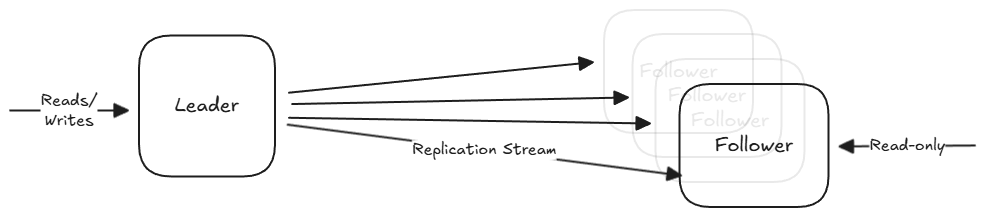

Replication means keeping a copy of the same data on multiple machines that are connected via a network. 

It comes with a number of benefits:
1. Availability: Replication allows a system to continue function even if parts of it fail. When one machine fails, another can take over.
2. Read throughput: For workloads that are "read-heavy", we can scale the number of machines that serve queries (horizontal scaling), allowing us to distribute the read requests across those machines.
3. Reducing latency: We can place copies of the data geographically closer to the users, reducing the time they spend waiting for network packets to travel to their location.

## Leaders and Followers

We start with several nodes that each store a copy of the database (replicas). These are split up into two categories:

- **Leader (Master/Primary)**: The exclusive entry point for **writes**. When a client wants to change data, the request must go to the leader, which writes the change to its local storage first.
- **Followers (Read Replicas/Slaves)**: Read-only nodes from the client's perspective. They stay up to date by receiving a replication log from the leader. They apply every write in the same order that the leader processed them.

An important question to answer when designing the system is whether the replication stream should be synchronous and asynchronous.

- **Synchronous Replication**: The leader waits for the follower to confirm that it has received and written the data to its local storage before reporting success to the client.
    - **Pros**: The follower is guaranteed to have an up-to-date copy of the data that is **consistent** with the leader. If the leader fails, you can be certain that the data exists on the follower.
    - **Cons**: If the synchronous follower becomes unreachable (due to a crash or network fault), the leader cannot process any more writes. It **must block** until the replica is available again.
    - In practice, people follow a **semi-synchronous** setup, where only one follower is synchronous while others remain asynchronous. 

- **Asynchronous Replication**: The leader sends the data change message to its followers but notifies the client of success immediately without waiting for a response.
    - **Pros**: High availability: The leader can continue processing writes even if all followers fall behind or the network is interrupted.
    - **Cons**: Low durability: If the leader fails and cannot be recovered, any writes that were not yet replicated are lost forever.

### Setting up new followers

Copying files from one node to another isn't enough since writes are constantly happening. The actual process looks like this:

1. Take a consistent snapshot of the leader's database without locking the system.
2. Move the snapshot to the new follower node.
3. The new follower connects to the leader and requests all the data changes since the snapshot was taken. This requires the snapshot to be tied to a specific position in the replication log.
4. Once the follower processes the backlog of changes, it has caught up and can continue receiving the live stream of data changes.

### Node outages

If a follower goes down, it is relatively easy to fix.
- Followers keep a local log of all the changes it has received. So it knows the last transaction it sucessfully processed before the fault.
- When it restarts, it connects to the leader, requests the missing data since that point, and catches up.

If a leader failures, it is much more complex because the system must choose a new leader and redirect all traffic. 
- Detection: Nodes ping each other; if the leader doesn't respond for a period (often a 30-second timeout), it is assumed to be dead.
- A new leader is chosen, typically the replica with the most up-to-date data to minimize loss.
- Clients are updated to send writes to the new leader.
- If the old leader comes back, it is forced to be a follower.

This process is dangerous for a few reasons:
- In asynchronous setups, the new leader might not have received all the writes before the old leader died. The common solution is to discard those unreplicated writes.
- Split brain: Two nodes might both believe they are the leader. If both accept writes, data will be corrupted or lost.
- A timeout that's too short can cause unnecessary failovers during temporary load spikes.

