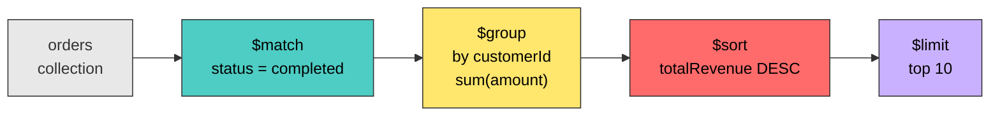
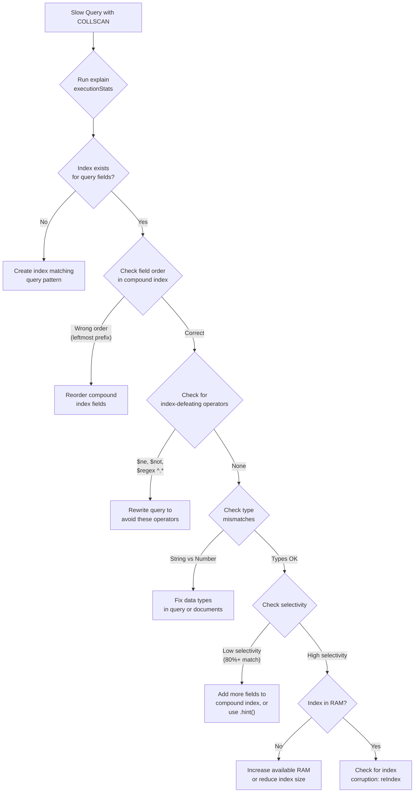
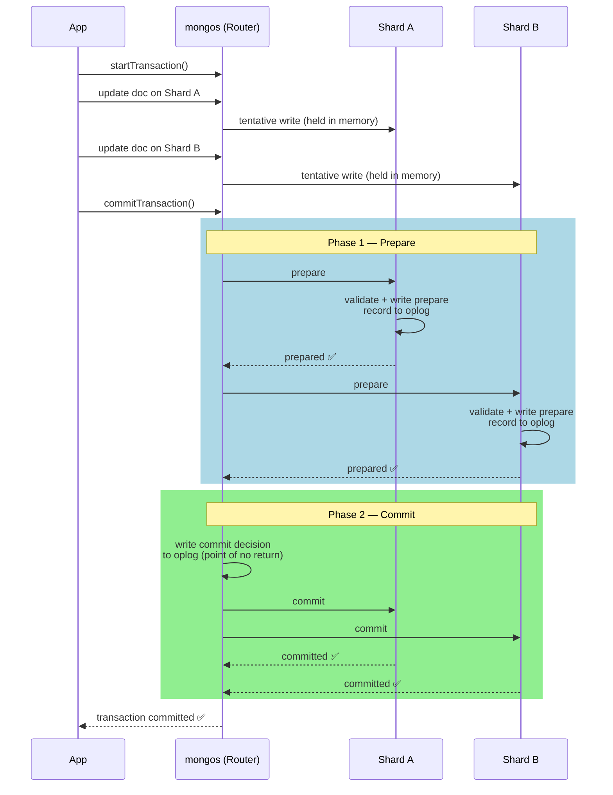
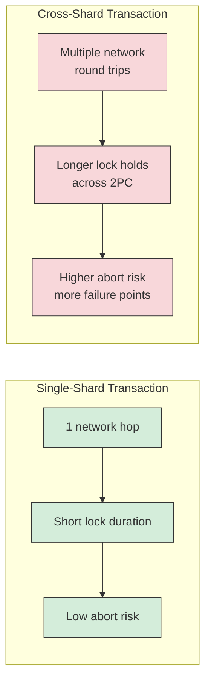

This is an overview of MongoDB using an "interview-style" approach, that I've been using for learning. I've found that it is a useful way to think more actively about the subject and test the boundaries of my knowledge.

This questions start with fundamentals (NoSQL, document format) all the way to more advanced distributed database concepts. 

## Q1 - What is MongoDB, and how does it differ from a traditional relational database? <span class="badge-difficulty badge-must-know">must-know</span>

MongoDB is a NoSQL document database. Instead of storing data in rows and columns within fixed-schema tables, it stores flexible JSON-like documents (internally BSON) inside collections.


<p align="center">
  
</p>

| Dimension | Relational (Postgres/MySQL) | MongoDB |
|---|---|---|
| **Schema** | Rigid, enforced at write time | Flexible; documents in the same collection can differ |
| **Data model** | Normalize across tables, JOIN at query time | Embed related data in a single document |
| **Query language** | SQL | Method/operator API (`find`, `$gt`, `$match`) |
| **Scaling** | Vertical by default; sharding via external tools | Built-in horizontal sharding |
| **Transactions** | Mature multi-row ACID | Multi-document ACID since v4.0, but single-doc operations are preferred |

**MongoDB** shines when data is naturally document-shaped (product catalogs, CMS, user profiles), the schema evolves frequently, you need horizontal write scaling, or reads are document-centric. **Relational** is the better fit when data has complex many-to-many relationships, you need cross-entity queries with JOINs, or strong transactional integrity is non-negotiable.

One reason MongoDB scales horizontally more easily than Postgres is architecture. Postgres is single-node by default. Replication gives read scaling, but writes go to a single primary and sharding requires external tools like Citus. MongoDB has built-in shard key mechanisms, config servers, and a `mongos` query router that handles distribution transparently.

MongoDB also fills a different niche than blob storage like S3. S3 is a file store where you put/get objects by key. MongoDB lets you **query inside** the data, create indexes, run aggregation pipelines, do partial updates, and provides low-latency reads with transactional semantics. The 16 MB document limit rules out large binary objects anyway. Many systems use both: MongoDB for hot, queryable data and S3 for raw archives and large assets.

---

## Q2 - What is a document in MongoDB, and what format does it use? <span class="badge-difficulty badge-must-know">must-know</span>

A document is the basic unit of data. It is analogous to a row in a relational table, but far more flexible. Documents are stored in **BSON** (Binary JSON).

```javascript
{
  "_id": ObjectId("507f1f77bcf86cd799439011"),
  "name": "Vishal",
  "roles": ["engineer", "mentor"],
  "team": {
    "name": "Strategy",
    "system": "IMC"
  }
}
```

Values can be strings, numbers, booleans, arrays, nested documents, dates, ObjectIds, binary data, Decimal128, and more.

### Why BSON over JSON?

- **Richer types**: `Date`, `ObjectId`, `Decimal128`, `int32` vs `int64` (none of which plain JSON supports)
- **Fast traversal**: Length-prefixed fields let MongoDB skip to the field it needs without parsing the entire document
- **Compact encoding**: BSON is more space-efficient than plain text JSON, which is important since MongoDB enforces a **16 MB size limit** per document

Documents live inside **collections**, which are roughly analogous to tables but enforce no schema by default.

---

## Q3 - What does the `_id` field do, and what happens if you don't provide one? <span class="badge-difficulty badge-must-know">must-know</span>

`_id` is a unique identifier for every document (primary key). No two documents in the same collection can share the same `_id`. MongoDB automatically creates a unique index on it.

If you don't provide one, MongoDB generates an **ObjectId**: a 12-byte value with built-in structure:


<p align="center">
  
</p>

- The **timestamp** component means ObjectIds are roughly sortable by creation time
- You can extract the creation timestamp with `ObjectId.getTimestamp()`
- You *can* provide your own `_id` (string, number, etc.), but you're responsible for uniqueness

---

## Q4 - What is the difference between `find()` and `findOne()`? <span class="badge-difficulty badge-easy">easy</span>


- **`find()`** returns a **cursor**, a lazy iterator that serves documents in batches. You chain `.sort()`, `.limit()`, `.skip()` onto it.
- **`findOne()`** returns a single document directly, not a cursor. Effectively `find().limit(1)`.
- `findOne()` is **deterministic**, not random. It returns the first match based on natural order or the index being used.

<p align="center">
  
</p>

**When to use which**: `findOne()` for lookups by `_id` or a unique field. `find()` any time you expect or want multiple results.

The cursor returned by `find()` works on two levels. **Server-side**, MongoDB holds a reference to the result set, serving 101 documents in the first batch, then 16 MB batches. It has a **10-minute inactivity timeout**. 

**Client-side (Java)**, the driver returns a `FindIterable` / `MongoCursor`. The query doesn't execute until you start iterating (lazy evaluation). Close the cursor to avoid server-side leaks:

```java
FindIterable<Document> results = collection.find(eq("status", "active"));
try (MongoCursor<Document> cursor = results.iterator()) {
    while (cursor.hasNext()) {
        Document doc = cursor.next();
        // process
    }
}
```

---

## Q5 - How do you create an index, and why would you want to? <span class="badge-difficulty badge-easy">easy</span>

The syntax for creating an index is as follows:
```javascript
db.collection.createIndex({ fieldName: 1 })   // ascending
db.collection.createIndex({ fieldName: -1 })  // descending
```

Without an index, every query does a **COLLSCAN**, reading every document. $O(n)$. With an index, it's a B+ tree lookup: $O(\log n)$.


<p align="center">
  
</p>

### Index Types

| Type | Example | Purpose |
|---|---|---|
| Single field | `{ age: 1 }` | Index on one field |
| Compound | `{ status: 1, createdAt: -1 }` | Multi-field; order matters |
| Unique | `{ email: 1 }, { unique: true }` | Enforces uniqueness |
| Text | `{ description: "text" }` | Full-text search |
| TTL | `{ createdAt: 1 }, { expireAfterSeconds: 3600 }` | Auto-deletes documents after a time period |

**Trade-off**: Indexes speed up reads but slow down writes (every insert/update/delete must also update the index). They also consume memory. Index based on your actual query patterns.

### The Leftmost Prefix Rule

For a compound index `{ status: 1, customerId: 1, createdAt: -1 }`, MongoDB can only use it if the query includes fields **starting from the left**.

<p align="center">
  
</p>

It's like looking up a first name in a phone book sorted by last name first: you have to start from the left.

### Selectivity and the Query Planner

**Selectivity** = matching documents / total documents. High selectivity (few matches) makes indexes valuable. Low selectivity (e.g., 80% of docs match) may cause the planner to prefer a COLLSCAN.

The query planner **races candidate plans** on first execution, caches the winner by query shape. The cache invalidates after significant writes, index changes, or server restarts.

Plans are cached based on query shape, not the actual values. If we run a low-selectivity query (`status: active` matching 80% of docs), the query planner will prefer a COLLSCAN and cache it.

If we run a followup query for a high-selectivitity value (`status: suspened` matching 0.1% of docs), the query planner will use the cached query shape and use a COLLSCAN read instead of using the index.

Compound indexes improve selectivity: even if no single field is selective, the combination can be. `{ status: "active", region: "Mumbai" }` might narrow 500M docs to 25M (5%) vs 400M (80%) for status alone.

MongoDB also has a `hint` command to force the query planner to use the index regardless of the cached plan.

---

## Q6 - Explain embedding vs. referencing. What factors influence the choice? <span class="badge-difficulty badge-easy">easy</span>

**Embedding**: nest related data directly inside the parent document. Larger documents, but a single I/O call to get everything.

```javascript
// users collection — single document, single read
{
  "_id": ObjectId("64a1..."),
  "name": "Vishal",
  "address": {
    "street": "123 Main",
    "city": "Mumbai"
  },
  "orders": [
    { "item": "Book", "amount": 25 },
    { "item": "Pen",  "amount": 5 }
  ]
}
```

**Referencing**: store a reference (like a foreign key) and do a separate lookup. Smaller documents, but an additional round trip.

```javascript
// users collection
{
  "_id": ObjectId("64a1..."),
  "name": "Vishal",
  "address_id": ObjectId("64b2...")   // references addresses._id
}

// addresses collection — needs a $lookup (join) to fetch from the user
{
  "_id": ObjectId("64b2..."),         // matches user.address_id
  "street": "123 Main",
  "city": "Mumbai"
}
```

`$lookup` is MongoDB's equivalent of a SQL `JOIN` — it takes the `address_id` from the user document, finds the matching `_id` in the addresses collection, and merges the result. It runs server-side inside an aggregation pipeline.

Consider embedding when:
- The relationship is **one-to-one** or **one-to-few** (user with address, order with line items)
- The data is always accessed together
- The child data doesn't make sense on its own

Consider referencing when:
- The relationship is **one-to-many** or **many-to-many** with large cardinalities (a user with 10,000 comments would bloat toward the 16 MB limit)
- The child entity is accessed independently
- The referenced data changes frequently (with embedding, you'd update it everywhere; with referencing, update in one place)

> If you find yourself doing `$lookup` on every query across five collections, you've probably picked the wrong database or the wrong schema design. It's a spectrum, not a binary choice.

---

## Q7 - What is an aggregation pipeline? Walk through an example. <span class="badge-difficulty badge-easy">easy</span>

An aggregation pipeline is an array of **stages**, where each stage transforms data and passes its output to the next, like Unix pipes (`cat | grep | sort | uniq`).

### Example: Total revenue per customer from an orders collection



```javascript
db.orders.aggregate([
  { $match:  { status: "completed" } },
  { $group:  { _id: "$customerId", totalRevenue: { $sum: "$amount" } } },
  { $sort:   { totalRevenue: -1 } },
  { $limit:  10 }
])
```

### Common Stages

| Stage | SQL Equivalent | Purpose |
|---|---|---|
| `$match` | `WHERE` | Filter documents |
| `$group` | `GROUP BY` | Aggregate values |
| `$sort` | `ORDER BY` | Order results |
| `$project` | `SELECT` | Reshape / select fields |
| `$unwind` | `LATERAL FLATTEN` | Flatten arrays into one doc per element |
| `$lookup` | `JOIN` | Join with another collection |

**Performance tip**: put `$match` stages as early as possible to reduce the volume of documents flowing through later stages. MongoDB can use indexes on early `$match` stages and may merge/reorder stages internally.

---

## Q8 - 500M documents, queries are slow, `explain()` shows COLLSCAN, indexes exist but aren't used. Diagnose and fix. <span class="badge-difficulty badge-medium">medium</span>



### Query-Side Problems

- **Unindexed fields**: the query filters on fields the index doesn't cover
- **Wrong field order** in compound indexes. If the index is `{ status: 1, age: 1 }` but the query only filters on `age`, the leftmost prefix rule prevents usage
- **Index-defeating operators**: `$ne`, `$not`, `$regex` with leading wildcard. These force a COLLSCAN
- **Type mismatches**: field stored as string but queried as number

### Index-Side Problems

- **Index corruption**: rare, but fixable with `reIndex()`
- **Index not in memory**: with 500M documents, the index may be too large for RAM; the planner may decide COLLSCAN is cheaper

### Data-Side Problems

- **Low selectivity**: if an index on `status` has only two values and 80% are `"active"`, the planner decides scanning is cheaper

### Diagnostic Tools

- **`explain("executionStats")`**: which plan was chosen, indexes considered and rejected, and why
- **`$indexStats`**: usage frequency per index
- **`mongotop` / `mongostat`**: server-level performance
- **Rejected plans** in explain output: alternatives the planner considered

---

## Q9 - Does MongoDB support ACID transactions? <span class="badge-difficulty badge-medium">medium</span>

TODO

---

## Q10 - Is MongoDB partition tolerant? How does its architecture handle network partitions? <span class="badge-difficulty badge-medium">medium</span>

TODO

---

## Q11 - Why is MongoDB considered CP-leaning? <span class="badge-difficulty badge-medium">medium</span>

The CAP theorem states that a distributed data store can only provide two of the following three guarantees simultaneously:
- **Consistency**: Every read receives the most recent write or an error.
- **Availability**: Every request receives a non-error response.
- **Partition Tolerance**: The systems continues to operate despite an arbitrary number of messages being delayred or dropped by the network.

By default, MongoDB is a CP system (consistent and partition-tolerant).

MongoDB uses a replica set with a single primary node.
- Writes: As of Mongo 5.0+, the majority of nodes must acknowledge the latest write before the primary can acknowledge the write. In Mongo 4.4 and below, only the primary needed to acknowledge the write. This can cause dataloss in the case where the primary acks and crashes before sending the data to the secondary nodes.
    - This guarantees partition-tolerance. The consensus check ensures that the system can return to a consistent state
- Reads: Strictly routed to the primary node. If the primary goes down, reads requests will fail until it comes back up or a new primary is elected.

---

## Q12 - What are read concerns and write concerns? How do they affect consistency and durability? <span class="badge-difficulty badge-hard">hard</span>

While MongoDB's architecture is CP-leaning, read and write concerns are configuration knobs that let you **tune the trade-off** between consistency/durability and latency/availability on a per-operation basis.

For writes concerns, we have the following configation:


| Write Concern | Behavior | Trade-off |
|---|---|---|
| `w: 0` | Fire and forget | Max throughput, no safety |
| `w: 1` (default) | Primary acknowledges | Fast, but data lost if primary dies before replication |
| `w: "majority"` | Majority of nodes confirm | Slower, but durable |


<p align="center">
  
</p>

### Read Concern

| Read Concern | Behavior | Risk |
|---|---|---|
| `"local"` (default) | Read whatever the node has | May read data that gets rolled back |
| `"available"` | Like `"local"`, but on sharded clusters returns data without checking if it's been orphaned by chunk migration | May return orphaned documents that no longer belong to this shard |
| `"majority"` | Only read majority-committed data | No rollback risk, but may not reflect the very latest write |
| `"linearizable"` | Confirms primary still holds majority lease, then returns most recent write | Slowest; primary-only; strongest guarantee |
| `"snapshot"` | Read from a consistent snapshot; used inside multi-document transactions | Only available within transactions |


### Write Durability vs. Read Consistency Matrix

These are two independent knobs. Write concern tunes **write durability** — how many copies exist before you're told "success." Read concern tunes **read consistency** — how fresh and accurate the data you see is. Writes are always CP (they require a reachable primary regardless of settings). Reads can behave AP-like — a secondary can serve stale reads during a partition with `readConcern: "local"`.

<table style="table-layout: fixed; width: 100%; border-collapse: collapse; font-size: 0.85em;">
  <thead>
    <tr>
      <th style="width: 15%; border: 1px solid #444; padding: 8px;"></th>
      <th style="width: 28%; border: 1px solid #444; padding: 8px; text-align: center;"><code>readConcern: "local"</code></th>
      <th style="width: 28%; border: 1px solid #444; padding: 8px; text-align: center;"><code>readConcern: "majority"</code></th>
      <th style="width: 29%; border: 1px solid #444; padding: 8px; text-align: center;"><code>readConcern: "linearizable"</code></th>
    </tr>
  </thead>
  <tbody>
    <tr>
      <td style="border: 1px solid #444; padding: 8px;"><strong><code>w: 0</code></strong></td>
      <td style="border: 1px solid #444; padding: 8px; background-color: rgba(255, 107, 107, 0.15);"><strong>Lowest latency, no safety.</strong> Writes: fire-and-forget, no durability. Reads: AP-like, can serve stale data from any node. Good for telemetry, metrics, logs.</td>
      <td style="border: 1px solid #444; padding: 8px;">Write may never arrive, so majority-read guarantee is meaningless. Inconsistent pairing.</td>
      <td style="border: 1px solid #444; padding: 8px;">Write may never arrive, so linearizable read guarantee is meaningless. Inconsistent pairing.</td>
    </tr>
    <tr>
      <td style="border: 1px solid #444; padding: 8px;"><strong><code>w: 1</code></strong></td>
      <td style="border: 1px solid #444; padding: 8px; background-color: rgba(255, 230, 109, 0.15);"><strong>Default.</strong> Writes: acknowledged by primary only, not durable if primary dies. Reads: AP-like, may return data that gets rolled back.</td>
      <td style="border: 1px solid #444; padding: 8px;">Reads won't be rolled back, but writes can still be lost if primary fails before replication.</td>
      <td style="border: 1px solid #444; padding: 8px;">Reads are strongly consistent, but writes can still be lost. Inconsistent pairing.</td>
    </tr>
    <tr>
      <td style="border: 1px solid #444; padding: 8px;"><strong><code>w: "majority"</code></strong></td>
      <td style="border: 1px solid #444; padding: 8px;">Writes are durable, but reads may return stale or rolled-back data.</td>
      <td style="border: 1px solid #444; padding: 8px;">Durable writes + safe reads. No rollback risk on either side. Good balance for most apps.</td>
      <td style="border: 1px solid #444; padding: 8px; background-color: rgba(78, 205, 196, 0.15);"><strong>Strongest consistency.</strong> Writes: durable (CP). Reads: linearizable (CP), always see the latest majority-committed write. Highest latency.</td>
    </tr>
  </tbody>
</table>

---

## Q13 - How does MongoDB handle transactions across multiple shards? What are the limitations? <span class="badge-difficulty badge-hard">hard</span>

### Single-Shard: The Easy Case

If all documents in a transaction live on the same shard, it behaves like a single-replica-set transaction. One node coordinates, no cross-network overhead. This is the ideal case.

### Cross-Shard: Two-Phase Commit

When a transaction spans multiple shards, MongoDB uses a **two-phase commit** protocol:



**Phase 1 (Prepare)**: Each shard validates its operations, writes a **durable prepare record** to its oplog, holds write locks on affected documents, and responds "prepared" or "abort." Prepare records are crash-safe. If a shard restarts, it reads the oplog and asks the coordinator whether to commit or abort.

**Phase 2 (Commit)**: Once all shards confirm prepared, the coordinator writes a **commit decision** to its oplog (point of no return) and tells all shards to finalize. Other readers see pre-transaction state until commit via snapshot isolation.

### What Can Go Wrong

- **Write conflicts**: another operation touched the same document
- **Lock timeouts**: locks held too long waiting for prepare
- **Node failures**: triggers abort and cleanup on recovery
- **Snapshot too old**: transaction took too long, snapshot expired
- **mongos crash before prepare**: nothing durable was written, tentative changes cleaned up on session timeout

### Performance Cost vs. Single-Shard



The best way to handle cross-shard transactions is to **design your schema so you rarely need them**. Choose the right shard key by sharding on the entity that ties your most common transactions together. Sharding both `orders` and `customers` by `customerId` keeps each customer's data colocated. Embed related data instead of referencing when it's always accessed together, since a single atomic document update avoids transactions entirely. Denormalize by copying needed fields from one entity into another, trading storage/update complexity for avoiding cross-collection lookups.

> The shard key is the most important decision in a sharded MongoDB deployment. The two-phase commit exists as a safety net, not a primary access pattern.
